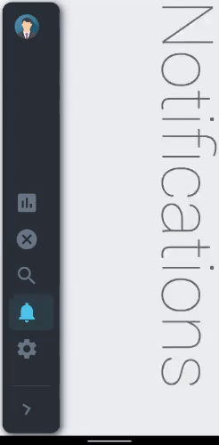

# collapsible_sidebar
-------------------------------------------------------------

A collapsible sidebar for Flutter apps implementing the Material Design.




## Features 

* Material Design
* Pre-built customizable tile widgets (CollapsibleItems)
* Smooth Animation

## Supported platforms

* Flutter Android
* Flutter iOS
* Flutter web
* Flutter desktop

## 🌟 Version 1.0.7 ✨
-------------------------------

* Added ability to handle lists of icons
* Added ability to apply bottom and top padding to List of icons
* Added ability to choose direction of icon tiles (top/bottom) using ```fitItemsToBottom```
* Added ability to give custom name to toggle button

## Live preview

https://ryuukenshi.github.io/collapsible_sidebar

Note: this page is built with flutter-web. For a better user experience, please use a mobile device to open this link.

## Installation

Add `collapsible_sidebar: ^1.0.7` to your `pubspec.yaml` dependencies. And import it:

```dart
import 'package:collapsible_sidebar/collapsible_sidebar.dart';
```

## How to use

Simply create a `CollapsibleSidebar` widget and a list of `CollapsibleItems` suppose `_items`. Finally add the required parameters to `CollapsibleSidebar` and a `body` widget suppose `_body` which will occupy the remaining screen:

```dart
CollapsibleSidebar(
  items: _items,
  avatarImg: _avatarImg,
  title: 'John Smith',
  body: _body,
)
```

## Parameters

```dart

CollapsibleSidebar(
    items: _items,
    title: 'Lorem Ipsum',
    avatarImg: NetworkImage('https://www.w3schools.com/howto/img_avatar.png'),
    body: _body,
    height: double.infinity,
    minWidth: 80,
    maxWidth: 270,
    borderRadius: 15,
    iconSize: 40,
    textSize: 20,
    toggleTitle: 'Collapse', //title text of Toggle Button
    toggleButtonIcon: Icons.chevron_right,
    backgroundColor: Color(0xff2B3138),
    selectedIconBox: Color(0xff2F4047),
    selectedIconColor: Color(0xff4AC6EA),
    selectedTextColor: Color(0xffF3F7F7),
    unselectedIconColor: Color(0xff6A7886),
    unselectedTextColor: Color(0xffC0C7D0),
    duration: Duration(milliseconds: 500),
    curve: Curves.fastLinearToSlowEaseIn,
    screenPadding: 4,
    topPadding: 0, //space between image avatar and icons
    bottomPadding: 0, //space between icons and toggle button
    fitItemsToBottom: true, //fit all icons to the end of the space between image avatar and toggle button
    showToggleButton: true,
)
```

## License
--------------------------------------------------------------

Apache 2.0
